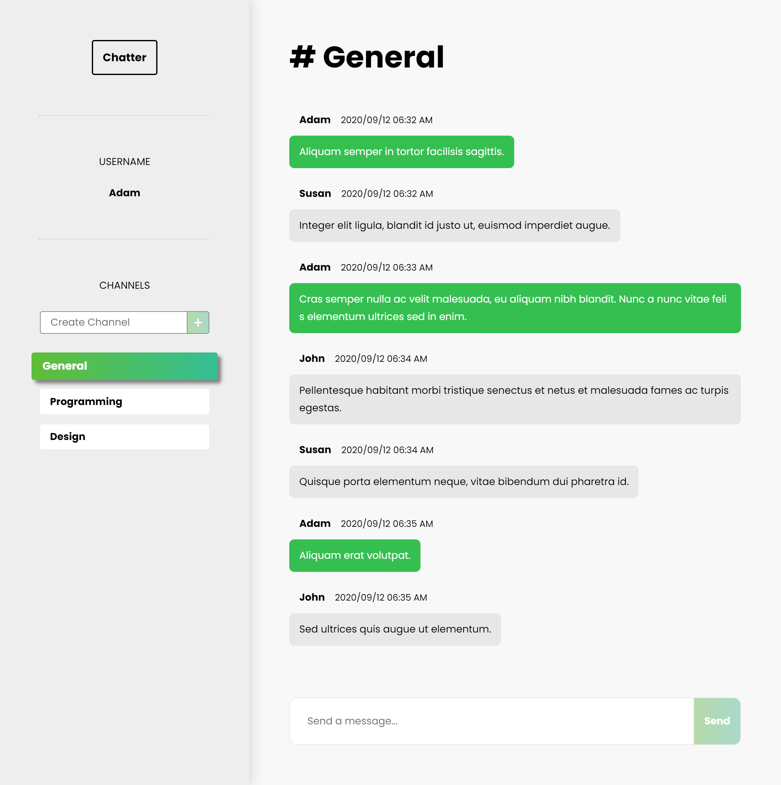

# Chatter

A chat application for the web with full-duplex communication, similar in spirit to Slack or mIRC. Users can choose a username, join or create channels, then begin chatting.

Built with JavaScript, WebSockets (SocketIO), and Python (Flask).

